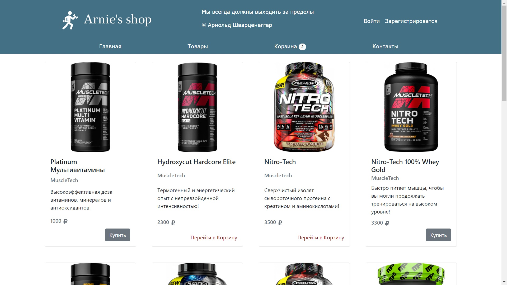
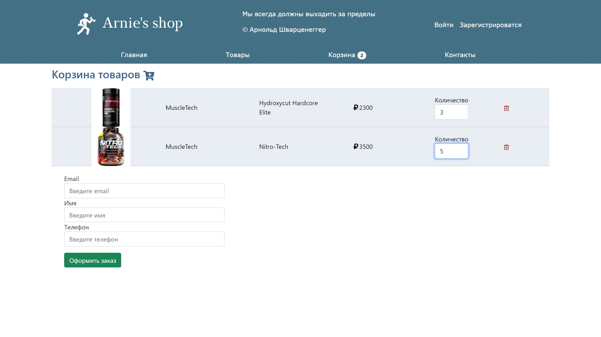
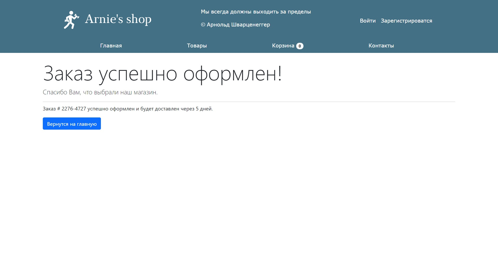
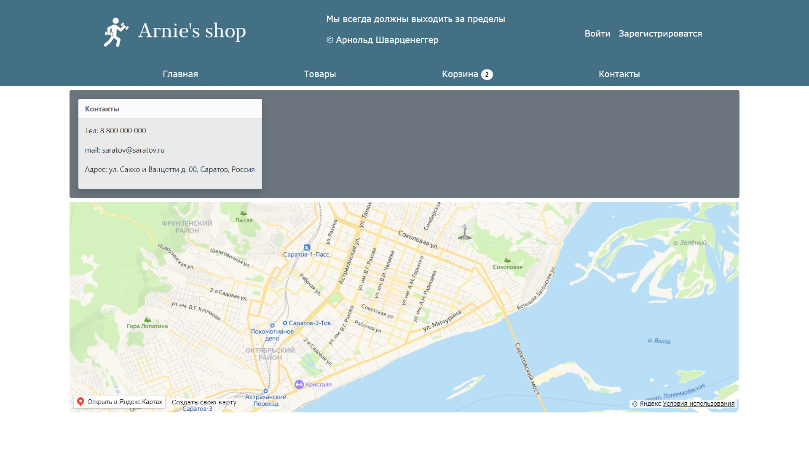

# Sport-Shop-Redux


Интернет – магазин товаров спортивного питания. 
Страница товаров, корзина, страница успешной покупки, контакты.
Использовался веб-фреймворк Express для обеспечения backend части приложения.
React, Redux, клиентский роутинг ( React Router). 
В качестве библиотеки компонентов использован reactstrap. 


Чтобы клонировать весь репозиторий, просто запустите:

```bash
git clone https://github.com/Igor-R64/Sport-Shop
```


Войдите в frontend каталог в новом терминале:
```
cd frontend
```
и запустите там следующие команды:
```
npm i
```
```
npm start ex
```

```
npm start
```

Это все. Теперь вы можете пользоваться приложением.

## Реализован функционал
* Загрузка карточек товаров с сервера.
* Заказ товара, добавление количества, удаление товаров.
* Отправка товаров на сервер при заказе.
* Страница успешной оплаты с указанием UUID данного заказа.
* Страница контактов с использованием react-yandex-maps.




